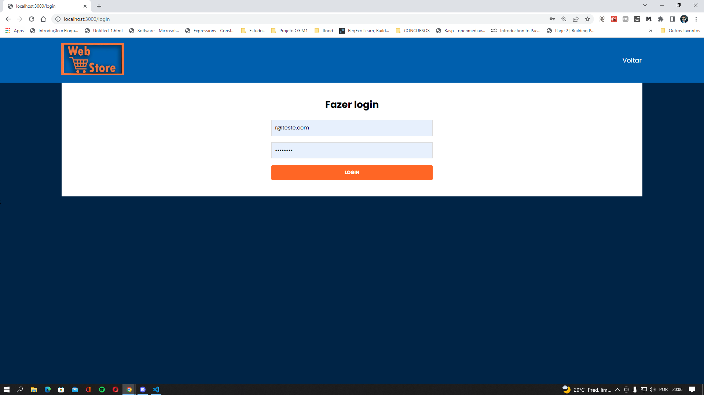
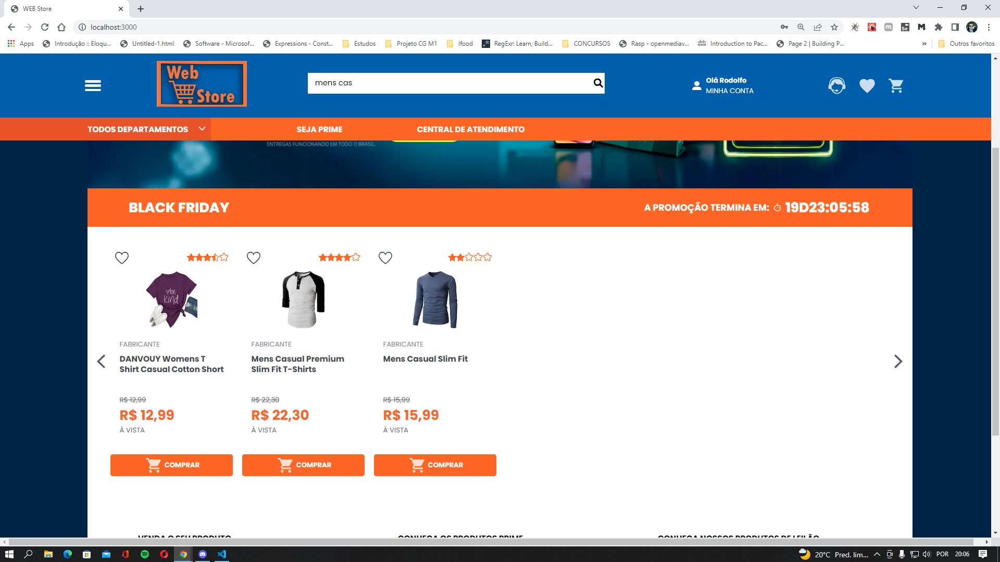
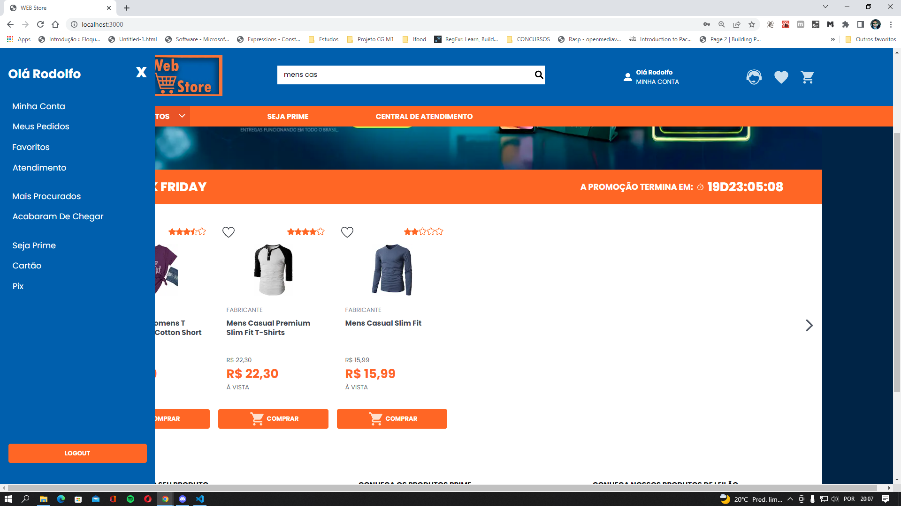

INTEGRANTES:

Felipe Galhardo RA - 160121 

Lucca Costa Lima D'Avila - 171903

Rodolfo Augusto RA - 163627 


## Instruções para executar o projeto local

__Programas necessários__

Deve ter o *NodeJS* instalado na sua máquina.

Para verificar se o NodeJs já está instalado, execute o seguinte comando no terminal

```
    node -v
```

Esse comando deve retornar uma resposta com um número da versão, segue um exemplo:

```
v16.14.2
```

Caso retorne que o comando ´node´ não foi encontrado, acesse o link a seguir para fazer a instalação do NodeJS.
Instale na versão LTS disponível.
https://nodejs.org/en/download/

**Executando o programa**

Abra a pasta no terminal pasta e faça a instalação das dependências, tanto na pasta **frontend** e **backend**. Para isso execute o comando:

```
npm install
```

Após a instalação execute o comando 

```
npm start
```

O backend executa no endereço http://localhost:3003.
O frontend executa http://localhost:3000, use esse endereço para acessar a página que o site estará executando.


## Descrição do Projeto

O projeto  é uma simulação de e-commerce, contendo uma página inicial com carrossel de produtos e busca por nome.
Se o usuário estiver logado no “site” irá conseguir adicionar produtos do carrossel ou por busca de nome em seu carrinho e fazer visualização dos itens que contêm em seu carrinho.
Os produtos serão previamente cadastrados para serem consumidos pelo front-end, a nossa API será encarregada de criar um carrinho com os produtos adicionados pelo usuário. O usuário só terá acesso a função quando estiver logado, para isso o site vai conter uma página de login de usuários.

**Ferramentas**

O projeto foi desenvolvido utilizando NodeJS, NextJS e o banco de dados foi utilizado MongoDB.

A API funciona como um servidor express, utilizando a biblioteca Mongoose para fazer a comunição com o banco de dados.

O frontend foi desenvolvido utilizando o framework NextJS e a estilização dos componentes foi feita com StyledComponents.




